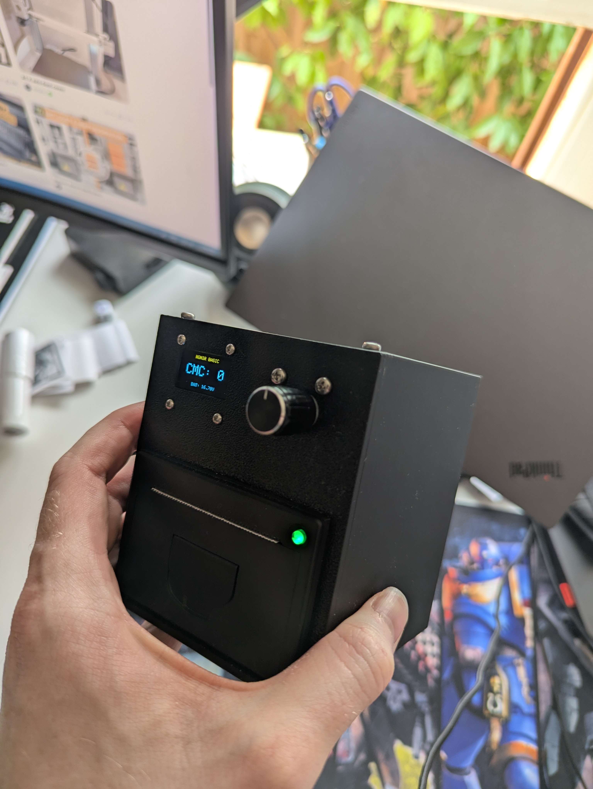
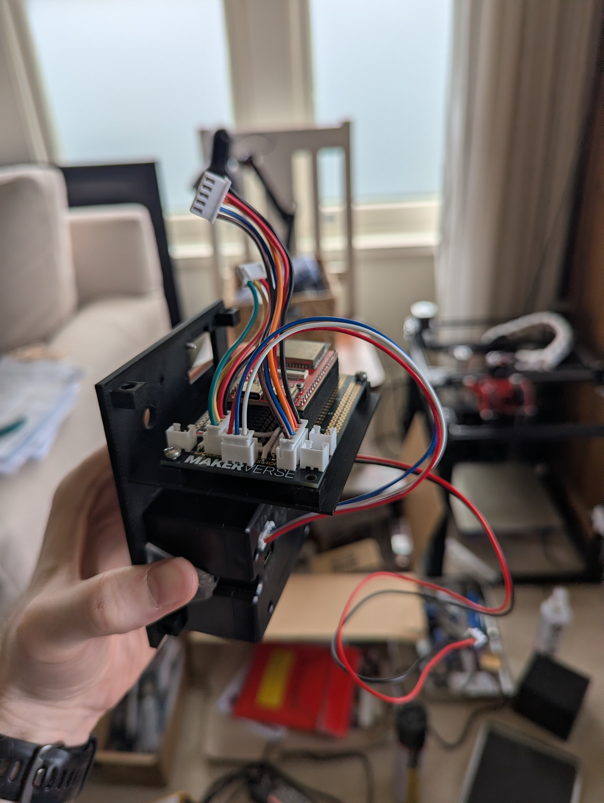
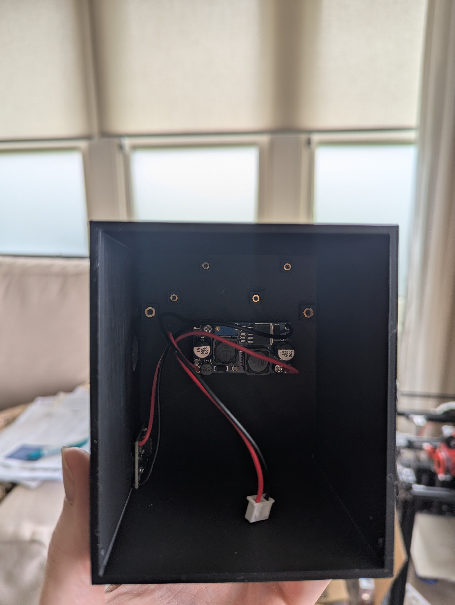
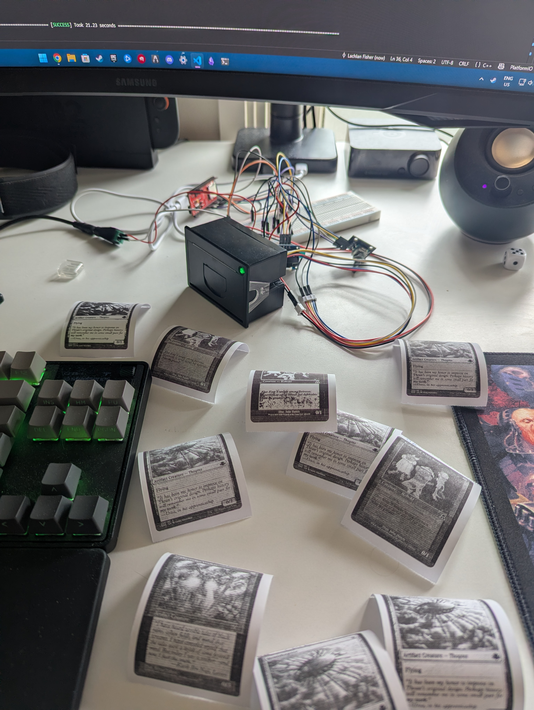
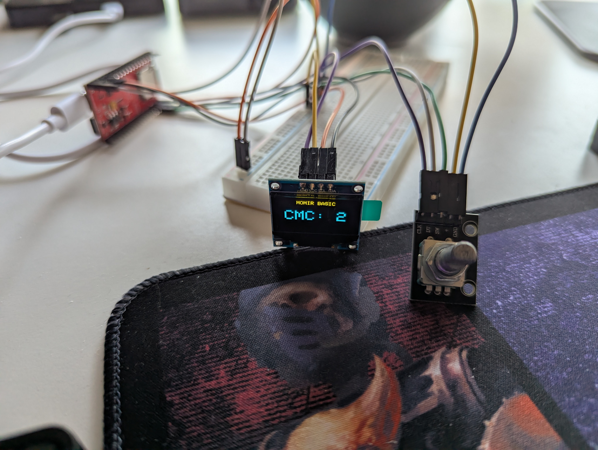

# ReceiptBasic

A custom hardware/software prototype for instantly generating and printing randomised Magic: The Gathering creature tokens via a thermal receipt printer.

> **Note**: This is a personal hobby project created as an exercise in full-stack embedded development.

## Overview

**ReceiptBasic** is a standalone, battery-powered embedded device driven by an ESP32-S3 microcontroller. It is intended to be used as a way to play  (a format in the card game Magic: The Gathering) in person. It allows users to dial in a Converted Mana Cost (CMC) via a physical rotary encoder and OLED display. Upon pressing the encoder, the device instantly fetches a random MTG creature token matching that CMC from an SD card and prints it directly onto thermal paper using a QR204 thermal receipt printer. Accessing the built in web server also gives options to print specific cards, or to print tokens.

## Key Features

- **Embedded User Interface:** An SSD1306 OLED and rotary encoder provide the UI for selecting the CMC.
- **Instant Thermal Printing:** Directly interfaces with a 384-dot wide QR204 serial thermal printer using raw bitmap streaming.
- **Headless Network Management:** Hosts an Async Web Server and Simple FTP Server over Wi-Fi, allowing new card image datasets to be uploaded to the SD-MMC card without removing it from the chassis (The FTP server is very slow. I do not recommend using it to update the SD card contents, rather to test different image profiles).
- **Over-The-Air (OTA) Updates:** Includes `ElegantOTA` to flash new firmware remotely (192.168.4.1/update).
- **Battery Management System:** Includes battery voltage sensing.
- **Charging:** Uses a USB-C PD board set to 20V (input volatage will be lower if the power supply does not support 20V) into a buck/boost converter outputting 18V, into a buck CC/CV charger that charges the homemade 4S 18650 pack. It would have been much easier to use a dedicated power supply to charge it, but I really wanted it to be USB-C. I did try designing my own PCB for this, however that proved to be too challenging for now.

## Tech Stack

**Hardware**
- **MCU:** Espressif ESP32-S3 (WROOM) from Freenove
- **Peripherals:** QR204 Thermal Printer, SSD1306 OLED, Rotary Encoder, SD-MMC, 4S 18650 Battery, USB-C PD sink

**Software / Firmware**
- **C++ (PlatformIO):** Used for the core ESP32 firmware running a multi-component control loop to handle inputs, displays, networking, and serial printer commands.
- **Python (Data Generation Tooling):** Custom tooling (`scripts/`) built with `PIL` (Pillow) and `requests` to:
  - Query card data APIs and curate token/creature datasets.
  - Scale down artwork to strictly match the 384-dot thermal width limit.
  - Convert full-colour art into optimised 1-bit monochrome binary bitmaps with heavy contrast enhancement and specialised dithering suited for thermal heads.

## Images

### Final Product

### Case Front Prototype

### Case Back Prototype

### Breadboard Testing

### Display Prototype

## Architecture & Workflow

1. **Data Pipeline:** Python scripts run prior to deployment, fetching card imagery, converting to monochrome formats, categorising into hierarchical SD card directories by CMC (e.g., `/data/cards/2/`), and packaging `.bin` index files.
2. **Boot & Initialisation:** The ESP32 boots, mounts the SD-MMC for high-speed file access, initialises UI/printer drivers, and spawns background server tasks for OTA and FTP.
3. **User Operation:** Turning the rotary encoder shifts the targeted CMC. A button press reads an index file to fetch a random card filepath in standard execution time.
4. **Data Streaming:** Buffers pull the raw 1-bit pixel payloads from the SD card and stream the binary packet stream over serial UART directly to the thermal receipt printer to yield the final token output on demand.
